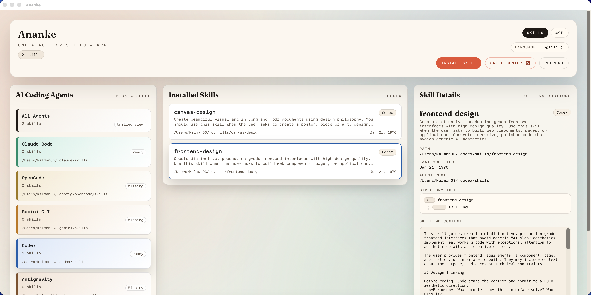
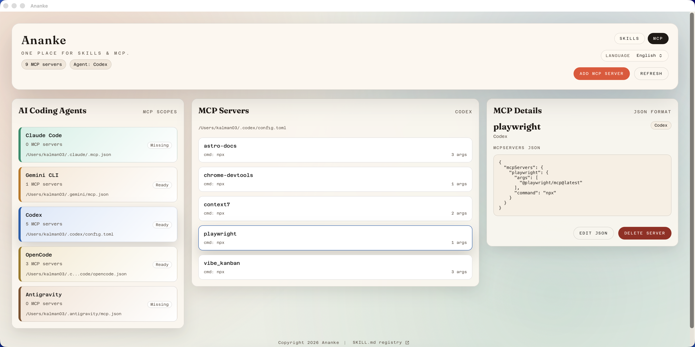

# Ananke 

<p align="center">
  <strong>The Visual Control Plane for MCP Servers & AI Skills.</strong>
</p>
<p align="center">
  
  
  
  
</p>


---

## 🚀 What is Ananke?

**Ananke** is a powerful, local-first desktop application designed to simplify the management of **Model Context Protocol (MCP)** servers and AI **Skills**. 

Managing MCP configurations often involves wrestling with complex JSON files and command-line interfaces. Ananke provides a sleek visual interface to install, configure, and monitor your AI tools—keeping your data private and your workflow efficient.

## ✨ Key Features

- **Visual Management**: Toggle, configure, and update MCP servers via a clean GUI. No more manual JSON editing.
- **Local-first Architecture**: Your configurations and keys stay on your machine. Privacy is not a feature; it's the foundation.
- **Skill Hub**: Discover and deploy new capabilities to your AI models with a single click.

## 🛠️ Getting Started

### Installation
Download the latest version for your OS from the [Releases](../../releases) page.

### Development
We use **Tauri** + **React** to build a lightweight experience.
```bash
# Clone the repo
git clone [https://github.com/your-repo/ananke.git](https://github.com/your-repo/ananke.git)
cd ananke

# Install dependencies
npm install

# Run in development mode
npm run tauri dev
```

## 📸 Preview




## 📄 License

Distributed under the Apache License. See `LICENSE` for more information.

---

<p align="center">
  Built with ❤️ 
</p>